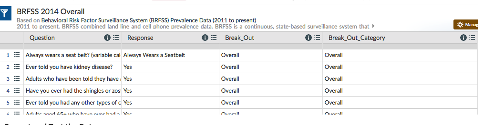

# Summary/Story telling of this visualization

1. Percentage of people in Poverty correlates very closely with the lack of Health Coverage in every State including Guam. 
2. Guam, has the highest poverty rate with more than half the population is in poverty. 
3. About half of 50 States have 20% or above of the population in Poverty
4. About 40 states have 10% or above of its population not covered with any healthcare. 

Study of Healthcare related expenses in statues with 15% or higher population without health care benefits will yield more info on the spending vs other states and also the age group of the population. 

# Unit 16 | Assignment - Data Journalism and D3 

#### Note: I had to run this below command to launch the jupyter notebook because of limitation of the png files data is used.
(PythonData) Sunithas-MacBook-Pro:Documents sunitharamakrishnan$ 
jupyter notebook --NotebookApp.iopub_data_rate_limit=10000000000

 
# Background
Welcome to the newsroom! You've just accepted a data visualization position for a major metro paper. You're tasked with analyzing the current trends shaping people's lives, as well as creating charts, graphs and interactives to help readers understand your findings.

The editor wants to run a series of feature stories about the health risks facing particular demographics. She's counting on you to sniff out the first story idea by sifting through the latest information from the U.S. Census Bureau and the Behavioral Risk Factor Surveillance System.

The beat reporters will go out and investigate the relationship you find, sourcing experts and finding anecdotes to back up your research. That's tough work, and they won't be happy about digging for a story that doesn't exist—you'll need to find a convincing correlation before you even think about pitching your first article. The editor also wants you to make a scatter plot to show the correlation—you are the data visualizer, after all.

# Your Task
Level 1: D3 Dabbler

 
 You need to find a correlation between two data variables, each measured state by state and taken from different data sources. You'll then visualize the correlation with a scatter plot and embed the graphic into an .html file. You need to accomplish these four steps.

# 1 Find the Data 
 
 

Look for demographic information using the 2014 one-year estimates from the U.S. Census Bureau's American Community Survey. You can specify your information using the [American FactFinder tool](https://factfinder.census.gov/faces/nav/jsf/pages/searchresults.xhtml?refresh=t). When searching through the data, be sure to select these options in the left sidebar:

Topics -> Dataset -> 2014 ACS 1-year estimates

Geographies -> Select a geographic type -> State - 040 -> All States within United States and Puerto Rico

When you select those filters, use the search bar to chose the demographic of your choice, or browse through the entries already shown. Click the data that interests you and then download the .csv file.

Next, you'll search for data on health risks using 2014 survey data from the [Behavioral Risk Factor Surveillance](https://chronicdata.cdc.gov/Behavioral-Risk-Factors/BRFSS-2014-Overall/5ra3-ixqq) System. Note that we already filtered the data by year and break-out—you just need to find the behavioral risk you want to use. Filter the ###QUESTION### data on the site before downloading a specified .csv, or simply download the whole .csv file and use Excel's filtering tools.

 

 

# Question
## Do you have any kind of health care coverage? NO
 

 
 

 

# 2.  Format and Test the Data
Let's format your data for D3. With your two data types chosen, grab the value columns from each and paste them into a new Excel document. Create header names that you can easily call with JavaScript (concise, lowercased, camelCased). Make sure that your rows and columns line up—You may need to delete Guam from your datasheet so that your Census and BRFSS data matches.

### To make sure you have a solid trend, you need to test for correlation with Excel's =CORREL() function. Aim for a value either less than -0.5 or more than 0.5—these values would indicate a moderate correlation and a story that might be worth pursuing (shoot for -0.75 or 0.75 if you're feeling super diligent).

#### I took 7 data points of poverty and did the Excel's=CORREL() function' and found (poverty2 has value 0.6183)
 

 

If you don't find a value that matches, try at least four other demographic-risk combinations—if you can't find one that hits -0.5 or .5, just go with the most striking mix.
When you find a suitable match, delete any correlation cells from your sheet and save the file as data.csv. Place it in the data folder of your homework directory and move onto the next step. 

# 3. Visualize the Data
Using the D3 techniques we taught you in class, create a scatter plot that represents each state with circle elements. You'll code this graphic in the app.js file of your homework directory—make sure you pull in the data from data.csv by using the d3.csv function. Your scatter plot should ultimately appear like the image at the top of this section.

The x-values of the circles should match the demographic census data, while the y-values should represent the risk data.

Include state abbreviations in the circles.

Create and situate your axes and labels to the left and bottom of the chart.

Generate this chart in the d3.html file in your assignment directory.

#### Note: You'll need to use   "http-server" to display the graphic since you're pulling data in from a source outside of your app.js file.

# 4. Embed into an iframe
When your d3.html displays the graphic just as you'd like it to, embed it in index.html with an iframe. Add a quick written analysis of your data below the graphic.

You'll notice that at certain screen sizes, the iframe may cut off sections of your scatter plot. Don't worry about this unless you want to take on the final challenge.

# How to run the app on visual studio:

Note: also, remember that you’ll need to run a local web server to serve the HTML / CSV
you’re just opening the HTML file from your computer directly (step 2)

1) cd to your data directory:
    cd $Data-Journalism-and-D3/
    
2) python -m http.server

Sunithas-MacBook-Pro:Data-Journalism-and-D3 sunitharamakrishnan$ python -m http.server
Serving HTTP on 0.0.0.0 port 8000 (http://0.0.0.0:8000/) ...
127.0.0.1 - - [22/Mar/2018 12:13:48] "GET / HTTP/1.1" 200 -
127.0.0.1 - - [22/Mar/2018 12:13:48] "GET /style.css HTTP/1.1" 200 -
127.0.0.1 - - [22/Mar/2018 12:13:49] "GET /d3.html HTTP/1.1" 200 -
127.0.0.1 - - [22/Mar/2018 12:13:49] "GET /d3style.css HTTP/1.1" 200 -
127.0.0.1 - - [22/Mar/2018 12:13:49] "GET /app.js HTTP/1.1" 200 -
127.0.0.1 - - [22/Mar/2018 12:13:49] "GET /data/data.csv HTTP/1.1" 200 -

3) now on a web browser:
    
    http://0.0.0.0:8000/  <-- to look at the graphics data visualization chart.

# Level 2: Impress the Boss
Why make a static graphic when D3 lets you interact with your data?

7-animated-scatter
## 1. More Data, More Dynamics
You're going to include two more demographics and two more risks. Place additional labels in your scatter plot and give them click events so that your users can decide which data to display. Animate the transitions for your circles' locations as well as the range of your axes.

Hint: Try binding all of the .csv data to your circles. This will let you easily determine their x or y values when you click the labels.

Note: Don't worry about the correlation values for all your variable combos. Focus on the graphic’s interactivity for this stage (unless you're feeling super, super diligent).

## 2. Incorporate d3-tip
While the ticks on the axes allow us to infer approximate values for each circle, it's impossible to determine the true value without adding another layer of data. Enter tooltips: developers can implement these in their D3 graphics to reveal a specific element's data when the user hovers their cursor over the element. Add tooltips to your circles and display each tooltip with the data that the user has selected. Use the d3-tip.js plugin developed by Justin Palmer—we've already included this plugin in your assignment directory.

8-tooltip
Check out David Gotz's example to see how you should implement tooltips with d3-tip.
 

# Level 3: Mobile Moxie (Tough, but Rewarding)
9-responsive-d3.gif
Sure, there's plenty of desktop readers out there, but what about tablet and phone users? How would you optimize your scatter plot so that its data is accessible to all users? This will be one of the toughest tasks when making most D3 graphics—but taking it on will also help you stand out as a thorough data visualizer.

Add a function to your scatter plot that changes the look of your svg whenever the size of your window/iframe changes. D3 lacks a one-size-fits-all approach to mobile since every graph will look different depending on the topic and developer. You'll need to decide what attributes to morph for whenever the screen size changes. Make sure that the graph is visible in the index.html iframe.

Visit these links for advice on how to accomplish this:

Responsive Charts with D3 - Chris Amico

Responsive D3 article from Safari Books Online

Note: Some of the code in these articles will be outdated, like the axis code—each was written before D3 4.0. Regardless, the core concept remains the same: build a function to resize your chart and fire it with d3.select(window).on('resize', [name of your function]).

Assessment
Your final product will be assessed on the following metrics:

Completion of all steps in chosen level

Coherency of scatter plot (labels, ticks)

Visual attraction

Professionalism

Good luck!

Copyright
Coding Boot Camp (C) 2016. All Rights Reserved.
